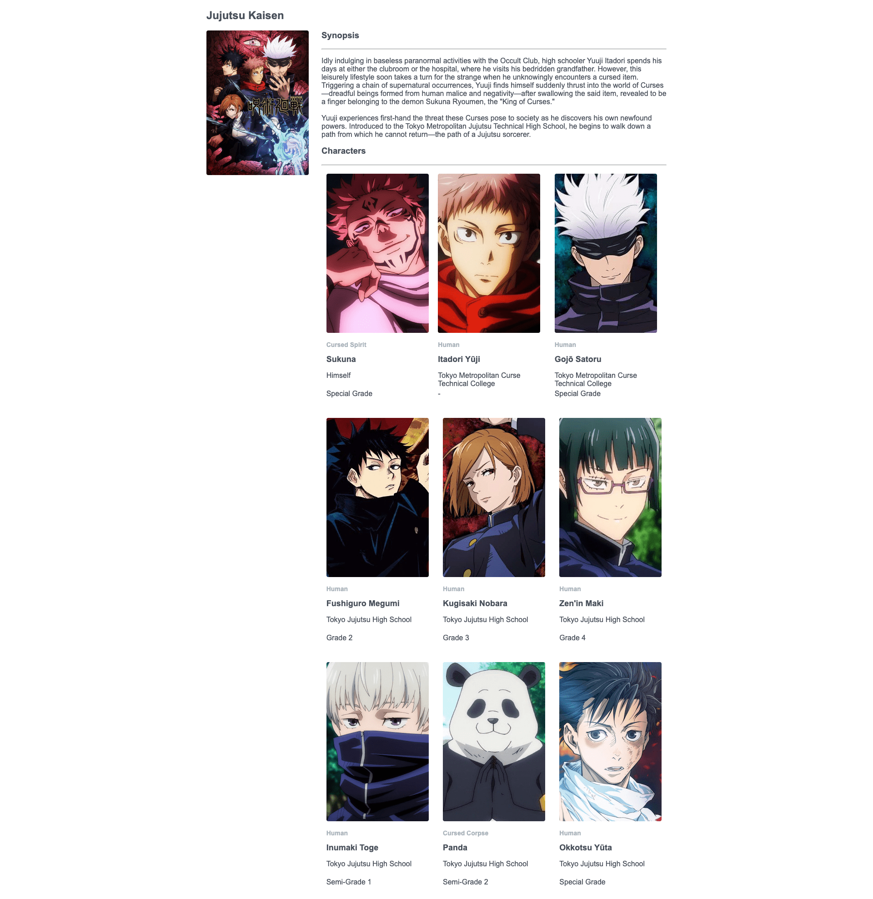

# React - Jujutsu Kaisen

## Live Coding

### Implementation technique

Siswa akan melaksanakan sesi live code di 20 menit terakhir dari sesi mentoring dan di awasi secara langsung oleh Mentor. Dengan penjelasan sebagai berikut:

-   **Durasi**: 20 menit pengerjaan
-   **Submit**: Maximum 10 menit setelah sesi mentoring menggunakan `grader-cli submit`
-   **Obligation**: Wajib melakukan _share screen_ di breakout room yang akan dibuatkan oleh Mentor pada saat mengerjakan Live Coding.

### NOTES

-   Pada skeleton kode yang terdapat file `main.test.js` tidak boleh diubah sama sekali.
-   Dilarang mengganti nama _function_ yang diberikan.
-   Wajib menjalankan `npm install` atau `pnpm install` sebelum mengerjakan project.
-   Kerjakan pada file `App.js` dan `Card.jsx`.

### Description

Pada _Live Code_ ini kalian diminta untuk melanjutkan pembuatan sebuah halaman _web_ Jujutsu Kaisen menggunakan **React Component**. Terdapat beberapa file _component_ `Card.jsx` yang sudah di sediakan pada folder `./src/components` dengan fungsi untuk me-_render_ _component_ _Card_ setiap karakter.

Buatlah _component_ _Card_ tersebut lalu _import_ dan gunakan pada file `./src/App.js`. Berikut penjelasan dari setiap _component_.

#### `App.js`

Pada file ini sudah terdapat _code_ yang perlu kalian lengkapi dan disediakan sebuah variable _charList_ berupa _Array of Objects_

```js
const charList = [
        {
            imageUrl:
                "https://cdn.myanimelist.net/images/characters/11/427601.jpg",
            name: "Itadori Yūji",
            species: "Human",
            affiliation: "Tokyo Metropolitan Curse Technical College",
            grade: "-",
        },
        {
            imageUrl:
                "https://cdn.myanimelist.net/images/characters/2/392689.jpg",
            name: "Fushiguro Megumi",
            species: "Human",
            affiliation: "Tokyo Jujutsu High School",
            grade: "Grade 2",
        },
        {
            imageUrl:
                "https://cdn.myanimelist.net/images/characters/12/422313.jpg",
            name: "Kugisaki Nobara",
            species: "Human",
            affiliation: "Tokyo Jujutsu High School",
            grade: "Grade 3",
        },
        ...
    ];
```

Selain itu kalian juga diminta melakukan beberapa hal, antara lain:

1. Me-_render_ _component_ `Card` sebanyak jumlah data.
2. Melempar data _charList_ pada _component_ `Card` sebagai _props_.

#### `Card.jsx`

_Component_ ini di gunakan untuk me-_render_ sebuah _Character Card_. Pada _component_ ini terdapat sebuah function `Card` yang menerima props dengan format sebagai berikut:

| Name          | Data Type |
| ------------- | --------- |
| _imageUrl_    | string    |
| _name_        | string    |
| _species_     | string    |
| _affiliation_ | string    |
| _grade_       | string    |

Pada bagian ini yang perlu kalian lakukan adalah membuat sebuah _Character Card_ dan menampilkan data `props` yang dilempar dari file `App.js` dengan **_minimum requirement_** sebagai berikut:

1. Memiliki _attribute_ `class` dengan _value_ `character-card`.
2. Memiliki _image_ dengan `src` dari props `imageUrl` dan `alt` dari props `name` (**tanpa ada prefix maupun suffix**).
3. Memiliki _species_ dari props `species` dengan menggunakan tag `p`.
4. Memiliki _name_ dari props `name` dengan menggunakan tag `p`.
5. Memiliki _affiliation_ dari props `affiliation` dengan menggunakan tag `p`.
6. Memiliki _grade_ dari props `grade` dengan menggunakan tag `p`.

Berikut ini format card yang **WAJIB** kalian ikuti:

```txt
<image>
<species>
<name>
<affiliation>
<grade>
```

### Preview

Berikut contoh dari halaman _web_ yang perlu di buat.


